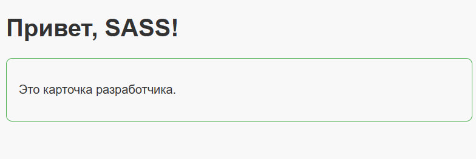

# Лабораторная работа №3
**CSS-препроцессоры: LESS и SASS**  
Автор: Дарья Александровна Роик  
Группа: 24ПИ2  
Преподаватель: Бричаг Д.В.

---

## Скриншоты

### Светлая тема

### Тёмная тема

> *Примечание:* для добавления скриншотов создай папку `screenshots` в проекте и положи туда изображения с именами `light.png` и `dark.png`.

---

## Ответы на вопросы

**1. Почему выбрали этот препроцессор?**  
Выбрала SASS, потому что он мощнее и гибче, поддерживает:  
- переменные для цветов, шрифтов и размеров;  
- вложенные селекторы для структурирования кода;  
- миксины для повторного использования стилей;  
- медиазапросы и условия прямо в SCSS.  

**2. Какие файлы для компонентов препроцессора создавали?**  
- `_variables.scss` — переменные для цветов и шрифтов;  
- `style.scss` — главный файл стилей с подключением переменных через `@use`;  
- `style.css` — скомпилированный CSS для браузера.

**3. Каким образом реализована тёмная тема страницы?**  
Созданы отдельные переменные для светлой и тёмной темы. Переключение темы реализовано через добавление класса `.dark` на тег `<body>` с помощью JavaScript (или вручную для демонстрации).

**4. Какие запросы делали LLM (ИИ-помощнику)?**  
- Сгенерировать пример SCSS с переменными и вложенностью;  
- Подсказать, как реализовать адаптивную карточку и медиазапросы;  
- Объяснить, как подключать файлы и компилировать SCSS в CSS;  
- Показать пример тёмной темы с переключателем.

---

## Результаты работы

1. Файлы SASS:  
   - `_variables.scss`  
   - `style.scss`  
   - скомпилированный CSS: `style.css`

2. Адаптивная веб-страница с карточкой разработчика и переключателем светлой/тёмной темы.

3. Репозиторий на GitHub с полным проектом.

4. README.md с отчётом и скриншотами.

---

## Инструкция по запуску проекта

1. Открыть `index.html` в браузере.  
2. Проверить работу адаптивности, уменьшив ширину окна.  
3. Проверить переключение темы (если добавлен JavaScript-код или класс `.dark`).  

---

